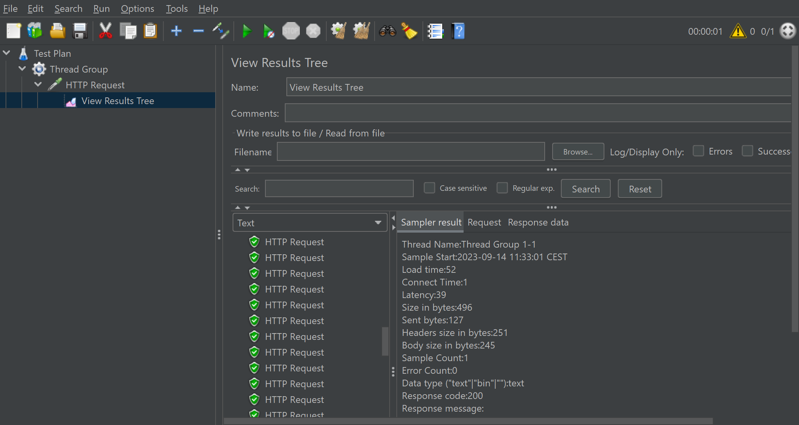

= Automation

== Aufgabe 1

Testing mit Postman 

[source,]
----
pm.test("Status code is 200", function () {
    pm.response.to.have.status(200);
});

 pm.test("Response is an array", function () {
    pm.expect(Array.isArray(pm.response.json())).to.be.true;
});

pm.test("All students have id, name, and email properties", function() {
    const students = pm.response.json();

    students.forEach(student => {
        pm.expect(student).to.have.property('id');
        pm.expect(student).to.have.property('name');
        pm.expect(student).to.have.property('email');
    });
});

pm.test("No student has an empty name or email", function () {
    const students = pm.response.json();
    students.forEach(student => {
        pm.expect(student.name).to.not.be.empty;
        pm.expect(student.email).to.not.be.empty;

    });
});

pm.test("All emails have the domain @tbz.ch", function () {
    const students = pm.response.json();
    students.forEach(student => {
       pm.expect(student.email).to.match(/@tbz.ch$/);
    });
});

pm.test("Number of students is 5", function () {
    const students = pm.response.json();
    pm.expect(students.length).to.equal(5);
});
----

== Aufgabe 4

JMeter kann man nutzen, um viele Requests auf einmal auf eine URL zu schicken um Beispielsweise die Stabilität der Seite zu überprüfen. 

